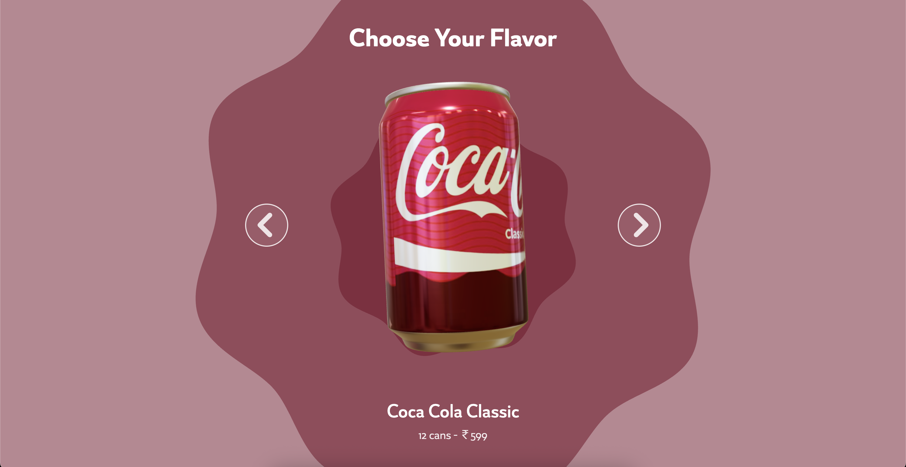
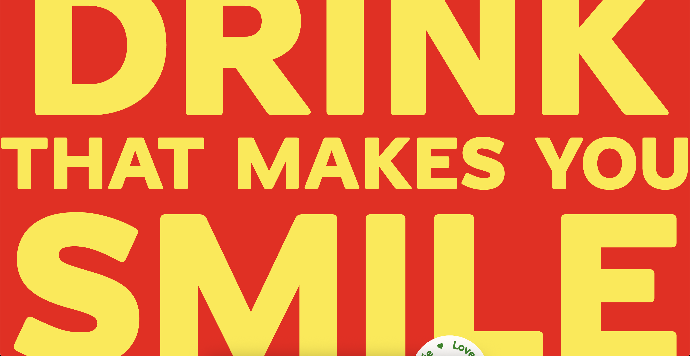

# 🥤 Coca-Cola - 3D Landing Page

  <h2>🎬 Project Screenshots</h2>
  
  
  
  
  
  
  
  

## 🚀 Key Features

| Feature | Description | Technology |
|---------|-------------|------------|
| 🎠 **Interactive Carousel** | 3D Soda Can Rotation with Multiple Flavors | Three.js, React Three Fiber |
| 📝 **Dynamic Text Sections** | Animated Typography & Content | GSAP, CSS Animations |
| 🪂 **Sky Dive Section** | Immersive 3D Environments | 3D Scenes, Environment Mapping |
| 🏠 **Hero Section** | 3D Scene with Floating Elements | Interactive 3D, Physics |
| 🎨 **Responsive Design** | Works on All Devices | Tailwind CSS, Mobile-First |

## 🎯 Project Sections

### 🎠 Interactive Carousel
- **5 Different Flavors**: Coca-Cola Classic, Fanta, Sprite, Thumbs Up, Minute Maid
- **3D Can Rotation** with physics-based spinning
- **Dynamic Color Changes** for each flavor
- **Smooth Transitions** between different soda varieties

### 📝 Dynamic Text Sections
- **Animated Typography** with staggered reveals
- **Scroll-triggered animations** that respond to user interaction
- **Professional typography** with custom font integration
- **Responsive text layouts** for all screen sizes

### 🪂 Sky Dive Section
- **Immersive 3D Environments** with realistic lighting
- **Interactive 3D elements** and animations
- **Performance optimized** rendering
- **Dynamic scene management**

### 🏠 Hero Section
- **3D Scene Integration** with floating elements
- **Scroll-triggered animations** that respond to user interaction
- **Dynamic background color transitions**
- **Responsive text animations** with staggered reveals