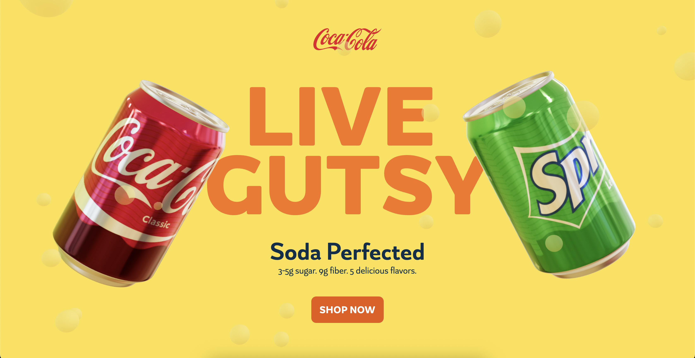

# 🥤 Coca-Cola - 3D Landing Page

<div align="center">
  <h2>🎬 Project Screenshots</h2>
  
  <div style="display: grid; grid-template-columns: repeat(auto-fit, minmax(300px, 1fr)); gap: 20px; margin: 20px 0;">
    <div style="text-align: center;">
      <h3>🏠 Hero Section</h3>
      
    </div>
    
    <div style="text-align: center;">
      <h3>🎠 Interactive Carousel</h3>
      
    </div>
    
    <div style="text-align: center;">
      <h3>📝 Big Text Section</h3>
      
    </div>
    
    <div style="text-align: center;">
      <h3>🪂 Sky Dive Section</h3>
      
    </div>
  </div>
</div>

<br>

A **stunning, interactive 3D landing page** that brings the fizzy world of Coca-Cola to life through cutting-edge web technologies. Experience smooth 3D animations, interactive soda cans, and immersive visual effects that showcase the future of web design.

## ✨ Features

### 🎮 Interactive 3D Elements
- **Floating 3D Soda Can** with realistic physics and animations
- **Interactive Carousel** featuring multiple Coca-Cola flavors
- **Dynamic Background Transitions** that respond to user interactions
- **Smooth 3D Rotations** and flavor switching animations

### 🎨 Visual Excellence
- **GSAP Animations** for buttery-smooth transitions
- **Responsive 3D Scenes** that adapt to any device
- **Dynamic Color Schemes** that change with each flavor
- **Professional Typography** with custom font integration

### 🚀 Modern Web Technologies
- **Next.js 14** with App Router for optimal performance
- **Three.js & React Three Fiber** for stunning 3D graphics
- **Prismic CMS** for easy content management
- **Tailwind CSS** for rapid, responsive styling

## 🛠️ Tech Stack

| Category | Technology |
|----------|------------|
| **Framework** | Next.js 14, React 18 |
| **3D Graphics** | Three.js, @react-three/fiber, @react-three/drei |
| **Animations** | GSAP, @gsap/react |
| **Styling** | Tailwind CSS, PostCSS |
| **State Management** | Zustand |
| **CMS** | Prismic |
| **Development** | TypeScript, ESLint, Prettier |

## 🎯 Key Components

### Hero Section
- **3D Scene Integration** with floating elements
- **Scroll-triggered animations** that respond to user interaction
- **Dynamic background color transitions**
- **Responsive text animations** with staggered reveals

### Interactive Carousel
- **5 Different Flavors**: Coca-Cola Classic, Fanta, Sprite, Thumbs Up, Minute Maid
- **3D Can Rotation** with physics-based spinning
- **Dynamic Color Changes** for each flavor
- **Smooth Transitions** between different soda varieties

### 3D Elements
- **FloatingCan Component** with realistic physics
- **SodaCan Component** with multiple flavor textures
- **Environment Mapping** for realistic lighting
- **Performance Optimized** rendering

## 🚀 Getting Started

### Prerequisites
- **Node.js 18+** (Latest LTS recommended)
- **npm** or **yarn** package manager

### Installation

1. **Clone the repository**
   ```bash
   git clone <your-repo-url>
   cd 3d-soda-landing-main
   ```

2. **Install dependencies**
   ```bash
   npm install
   ```

3. **Set up Prismic CMS** (Optional)
   - Create a Prismic account
   - Update your Prismic configuration in `prismicio.ts`
   - Or run without CMS for development

4. **Start development server**
   ```bash
   npm run dev
   ```

5. **Open your browser**
   Navigate to `http://localhost:3000`

## 📱 Available Scripts

| Command | Description |
|---------|-------------|
| `npm run dev` | Start development server with Prismic Slice Machine |
| `npm run build` | Build for production |
| `npm run start` | Start production server |
| `npm run lint` | Run ESLint for code quality |
| `npm run format` | Format code with Prettier |
| `npm run slicemachine` | Launch Prismic Slice Machine UI |

## 🌐 Deployment

### Vercel (Recommended)
This project is optimized for Vercel deployment:

1. **Push to GitHub**
2. **Connect to Vercel**
3. **Automatic builds and deployments**

### Other Platforms
- **Netlify**: Works great with Next.js
- **AWS Amplify**: Full-stack deployment
- **Docker**: Containerized deployment

## 🎨 Customization

### Adding New Flavors
Edit the `FLAVORS` array in `src/slices/Carousel/index.tsx`:

```typescript
const FLAVORS = [
  { flavor: "newFlavor", color: "#HEXCODE", name: "Flavor Name" },
  // ... existing flavors
];
```

### Modifying 3D Elements
- **Soda Can**: Update `src/components/SodaCan.tsx`
- **Animations**: Modify GSAP timelines in slice components
- **Styling**: Customize Tailwind classes and CSS variables

### Prismic CMS Integration
- **Slice Machine**: Run `npm run slicemachine` to edit content
- **Custom Types**: Modify `customtypes/` directory
- **API Integration**: Update `src/prismicio.ts`

## 📁 Project Structure

```
src/
├── app/                 # Next.js App Router
│   ├── [uid]/          # Dynamic routes
│   └── page.tsx        # Homepage
├── components/          # Reusable components
│   ├── Bounded.tsx     # Layout wrapper
│   ├── FloatingCan.tsx # 3D floating can
│   ├── SodaCan.tsx     # 3D soda can model
│   └── ViewCanvas.tsx  # 3D canvas wrapper
├── hooks/               # Custom React hooks
├── slices/              # Prismic CMS slices
│   ├── Hero/           # Hero section
│   ├── Carousel/       # Interactive carousel
│   ├── BigText/        # Text sections
│   └── SkyDive/        # Additional sections
└── prismicio.ts        # Prismic configuration
```

## 🔧 Configuration Files

- **`next.config.mjs`**: Next.js configuration
- **`tailwind.config.js`**: Tailwind CSS customization
- **`slicemachine.config.json`**: Prismic Slice Machine setup
- **`tsconfig.json`**: TypeScript configuration

## 🌟 Performance Features

- **Code Splitting** with Next.js App Router
- **3D Performance Optimization** with React Three Fiber
- **Image Optimization** with Next.js Image component
- **Lazy Loading** for 3D components
- **Responsive Design** for all device sizes

## 🤝 Contributing

1. **Fork the repository**
2. **Create a feature branch** (`git checkout -b feature/amazing-feature`)
3. **Commit your changes** (`git commit -m 'Add amazing feature'`)
4. **Push to the branch** (`git push origin feature/amazing-feature`)
5. **Open a Pull Request**

## 📄 License

This project is licensed under the **Apache-2.0 License** - see the [LICENSE](LICENSE) file for details.

## 🙏 Acknowledgments

- **Prismic** for the excellent CMS platform
- **Three.js** community for 3D web graphics
- **GSAP** team for powerful animation tools
- **Vercel** for seamless deployment

---

<div align="center">
  <strong>Made with ❤️ and lots of 🥤</strong>
</div>